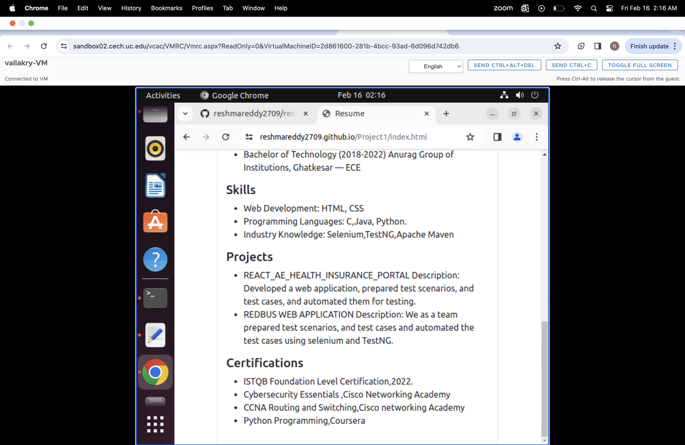

# WAPH-Web Application Programming and Hacking

## Instructor: Dr. Phu Phung

**Name**: Reshma Reddy Vallakonda

**Email**: vallakry@mail.uc.edu

*Short-bio*: Reshma Reddy Vallakonda is a UC Student who is interested in Front-end Web Development. 


## Repository Information

Respository's URL: [git@github.com:reshmareddy2709/waph-vallakry.git](git@github.com:reshmareddy2709/waph-vallakry.git)

This is a private repository for Reshma to store all code from the course.

# Individual Project 1 – Front-end Web Development with a Professional Profile Website on github.io cloud service

## Overview and Requirements 

For my first individual project, I created a professional profile website and hosted it on GitHub Pages. This website serves as a display for my resume, skills, and experiences. Additionally, it includes various technical features such as integrating a joke API, digital and analog clocks, displaying my email ID, weather API, and a flag counter. The main objectives of this project were to improve my skills in front-end web development and gain hands-on experience in deploying websites using GitHub Pages.

You can access my website through this link: [https://reshmareddy2709.github.io/Project1/index.html](https://reshmareddy2709.github.io/Project1/index.html)

To explore the Individual Project-1 repository, you can visit:[https://github.com/reshmareddy2709/reshmareddy2709.github.io](https://github.com/reshmareddy2709/reshmareddy2709.github.io)
## General Requirements

### Personal Website on Github.io

I made a new public repository called sheelada.github.io and built a personal website on GitHub Pages. The website includes sections for my resume, contact details, education, experiences, projects, certifications, and skills.

Here's the link to check out my website: [https://reshmareddy2709.github.io/Project1/index.html](https://reshmareddy2709.github.io/Project1/index.html)




### "Web Application Programming and Hacking" course and related hands-on projects on waph.html file

I added a separate page named waph.html to my repository, providing information about the "Web Application Programming and Hacking" course along with details about associated hands-on projects like Lab0, Lab1, Lab2, Hackathon 1, and Individual Project 1.

You can view the dedicated page here: [https://reshma2709.github.io/Project1/waph.html](https://reshma2709.github.io/Project1/waph.html).


## Non-technical requirements

### Bootstrap Template

I downloaded a Bootstrap template from https://bootstrapmade.com/ and customized it according to my needs and the tasks assigned by my professor.

### Page Tracker

I incorporated a Flag Counter as a page tracker to monitor visits and engagement on my website. I chose https://flagcounter.com/ for this purpose. To implement it, I generated a key from the website and integrated it into my code. You can see the Flag Counter visibly displayed on my website homepage.

Here is the code I used to integrate the Flag Counter:

```html
<div style="text-align:left;">
    <a href="https://info.flagcounter.com/szVl"></a>
</div>
```


## Technical requirements

### A digital clock; An analog clock; show/hide your email:

Similar to Lab 2, I implemented a digital clock and an analog clock on my website using JavaScript to showcase the current time. Additionally, I added functionality to dynamically show or hide the email address based on user interaction.

The JavaScript code for the clocks and email address functionality is as follows:
Source Code for digital clock:
```JS
function displayTime() {
          document.getElementById('digital-clock').innerHTML = "current time:" + new Date();
        }
        setInterval(displayTime, 500);
```

Source Code for Analog clock:
```JS
var canvas = document.getElementById("analog-clock");
        var ctx = canvas.getContext("2d");
        var radius = canvas.height / 2;
        ctx.translate(radius, radius);
        radius = radius * 0.90
        setInterval(drawClock, 1000);

        function drawClock() {
          drawFace(ctx, radius);
          drawNumbers(ctx, radius);
          drawTime(ctx, radius);
        }
```

Source Code for show/hide your email:

```JS
function showhideEmail() {
      if (shown) {
        document.getElementById('email').innerHTML = "Click here to show my email";
        shown = false;
      }
      else {
        var myemail = "<a href='mailto:sheelada" + "@" + "mail.uc.edu'>sheelada" + "@" + "mail.uc.edu</a>";
        document.getElementById('email').innerHTML = myemail;
        shown = true;
```


### One more Functionality of my choice

I successfully incorporated the Hacker News API into my website using the Vue.js framework. This integration enables the display of the top 5 trending articles from Hacker News.

Source code for Haacker news Api:
```JS
<script src="https://cdn.jsdelivr.net/npm/vue@2"></script>
```
 ```JS
new Vue({
el: '#app',
data: {
  articles: []
},
mounted() {
  this.fetchArticles();
},
methods: {
  fetchArticles() {
    fetch('https://hacker-news.firebaseio.com/v0/topstories.json')
      .then(response => response.json())
      .then(ids => {
        // Take only the first 10 article IDs
        ids = ids.slice(0, 5);
        // Fetch details of each article
        Promise.all(ids.map(id =>
          fetch(`https://hacker-news.firebaseio.com/v0/item/${id}.json`)
            .then(response => response.json())
        ))
          .then(articles => {
            // Update articles data
            this.articles = articles;
          });
      })
      .catch(error => console.error('Error fetching articles:', error));
  }
}
});
 ```


### Joke API

I've effectively incorporated the jokeAPI into my website, allowing it to retrieve a fresh joke every minute and dynamically present it on the page.

Source code for Joke API:

```JS
<div id="response"></div>
    <script>
        $(document).ready(function () {
            $.get("https://v2.jokeapi.dev/joke/Programming?type=single", function (result) {
                console.log("From jokeAPI: " + JSON.stringify(result));
                $("#response").html("A programming joke of the day: " + encodeInput(result.joke));
            });
        });

        function encodeInput(input) {
            // You can add your own encoding logic here if needed
            return input;
        }
    </script>
```

### Weather API

I've successfully integrated the Weatherbit API into my website, enabling it to retrieve and display current weather information for Cincinnati.

```JS

$(document).ready(function () {
// Fetch data from Weatherbit API
$.getJSON("https://api.weatherbit.io/v2.0/current?city=cincinnati&key=08d6dd69bae245f081687c17710408a2", function (data) {
  // Extract relevant weather information
  var temperature = data.data[0].temp;
  var description = data.data[0].weather.description;
  var iconCode = data.data[0].weather.icon;

  // Update weather information
  $("#weather-info").text("Current Temperature: " + temperature + "°C, Weather: " + description);

  //update weather icon
  $("#weather-icon").attr("src", "https://www.weatherbit.io/static/img/icons/" + iconCode + ".png");
  $("#weather-icon").attr("alt", description);
});
});

```


### Javascript Cookies

I have implemented JavaScript cookies on my website to remember the client's visit. Now, it displays personalized messages based on whether the user is a first-time visitor or a returning user. For first-time visitors, the message is "Welcome to my homepage!", and for returning users, it shows "Welcome back! Your last visit was (last visit time and date)".

```JS
// Function to set or retrieve the value of a cookie
function setCookie(name, value, days) {
var expires = "";
if (days) {
  var date = new Date();
  date.setTime(date.getTime() + (days * 24 * 60 * 60 * 1000));
  expires = "; expires=" + date.toUTCString();
}
document.cookie = name + "=" + (value || "") + expires + "; path=/";
}

function getCookie(name) {
var nameEQ = name + "=";
var ca = document.cookie.split(';');
for (var i = 0; i < ca.length; i++) {
  var c = ca[i];
  while (c.charAt(0) === ' ') c = c.substring(1, c.length);
  if (c.indexOf(nameEQ) === 0) return c.substring(nameEQ.length, c.length);
}
return null;
}

// Function to display the welcome message
function displayWelcomeMessage() {
var lastVisit = getCookie("lastVisit");
if (!lastVisit) {
  // First-time visit
  setCookie("lastVisit", new Date().toISOString(), 30); // Set cookie to expire in 30 days
  alert("Welcome to my homepage!");
} else {
  // Returning visit
  var lastVisitDate = new Date(lastVisit);
  alert("Welcome back! Your last visit was " + lastVisitDate.toLocaleString());
}
}

// Call the function when the page loads
window.onload = displayWelcomeMessage;

```


